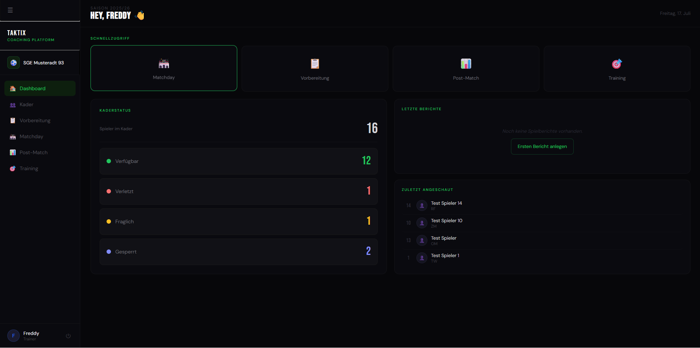
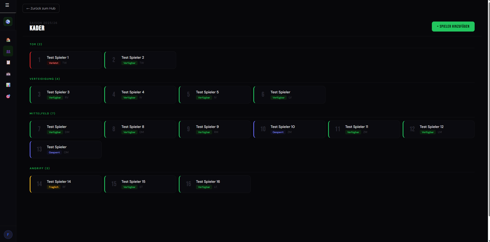
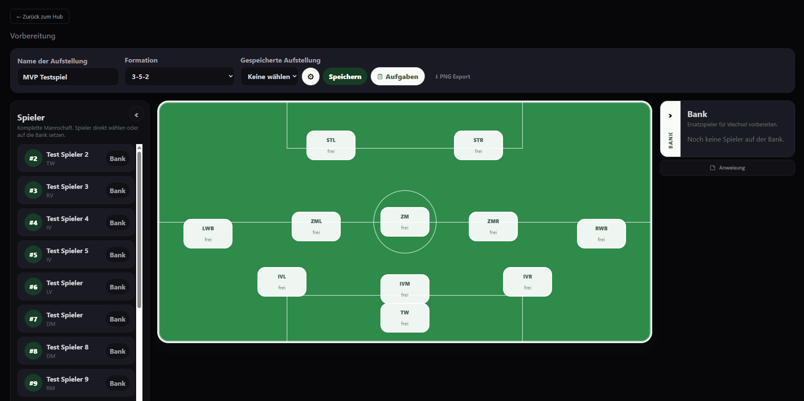
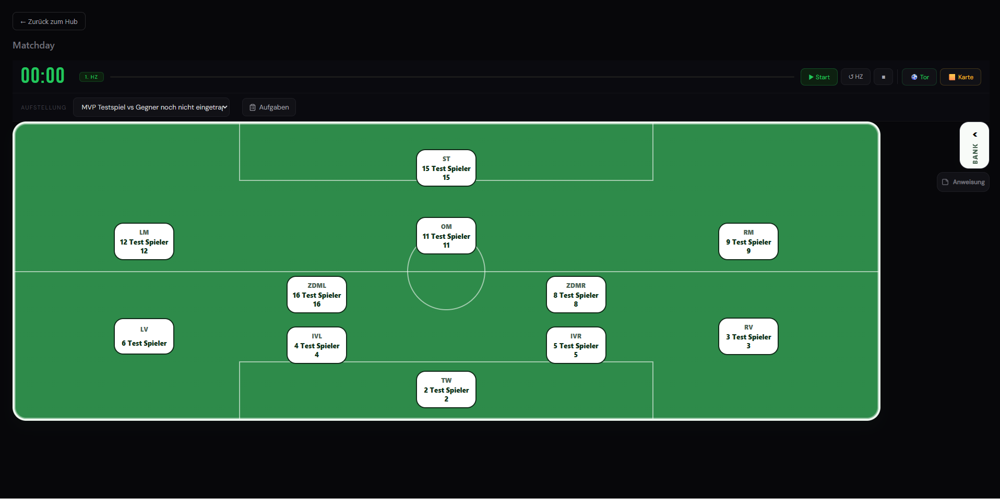
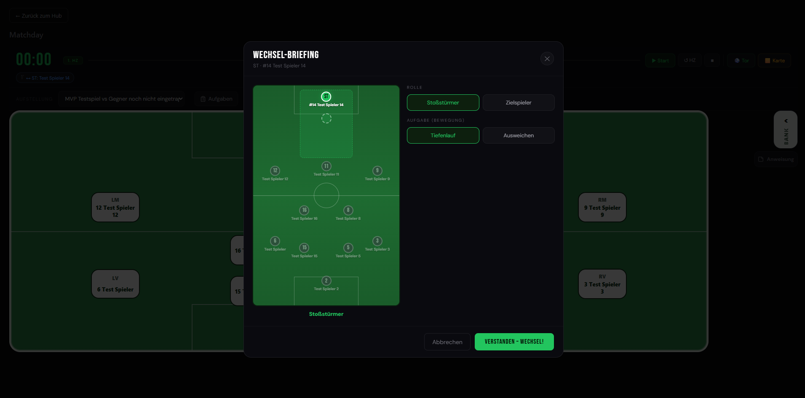
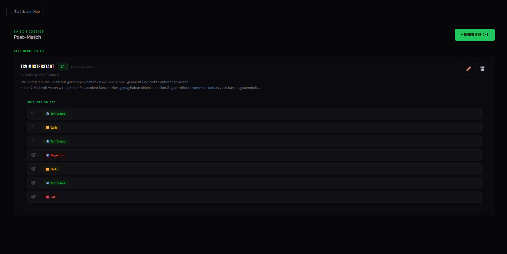
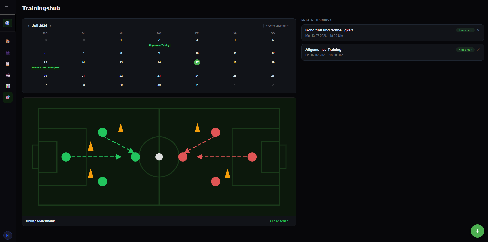

# Matchday Coaching App

Eine tablet-optimierte Coaching-App für Fußballtrainer – entwickelt für den Einsatz direkt am Spielfeldrand.

🔗 **Live-Demo:** [matchday-app-lqai.onrender.com](https://matchday-app-lqai.onrender.com)

---

## Inhaltsverzeichnis

1. [Über das Projekt](#über-das-projekt)
2. [Features](#features)
3. [Screenshots](#screenshots)
4. [Projektstruktur](#projektstruktur)
5. [Installation & Start](#installation--start)
6. [API-Endpunkte](#api-endpunkte)
7. [Datenmodelle](#datenmodelle)
8. [Roadmap](#roadmap)

---

## Über das Projekt

Die Matchday Coaching App unterstützt Fußballtrainer bei der Spielvorbereitung, Aufstellungsplanung und Spieltagssteuerung. Die App ist für den Einsatz auf Tablets im Querformat optimiert und läuft als Progressive Web App direkt im Browser.

**Tech-Stack:**
- **Backend:** Django REST Framework, PostgreSQL, JWT-Authentifizierung
- **Frontend:** React, Vite
- **Deployment:** Render

---

## Features

### Aktuell verfügbar
- **Authentifizierung** – Registrierung und Login mit JWT
- **Kader** – Spielerverwaltung mit Rückennummer, Position und Attributen (Technisch / Mental / Physisch)
- **Vorbereitung** – Aufstellungsplanung mit Formation, Startelf und Bank; kurze Anweisungen pro Spieler
- **Matchday** – Live-Spieltagsansicht mit Spieltimer, Wechseln, Wechsel-Briefing (FM-Look), Torereignissen und Karten
- **Post-Match** – Automatische Berichterstellung mit Spielergebnis aus Events, Notizen und Spieleranalyse
- **Trainingshub** – Trainingsplanung mit automatisch generierten Trainingsblöcken (Aktivierung, Spielform 1, Zwischenblock, Spielform 2)

### Nicht enthalten (geplant)
- Rollen- und Rechtesystem (Trainer / Spieler)
- Mehrvereinsfähigkeit / Multi-Tenant
- KI-basierte Spielanalyse
- Taktikboard mit Zeichenfunktion

---

## Screenshots

### Dashboard


### Kader


### Vorbereitung


### Matchday


### Wechsel-Briefing


### Post-Match Bericht


### Trainingshub


---

## Projektstruktur

```
matchday_mvp/
├── backend/
│   ├── core/               # Settings, URLs
│   ├── auth_app/           # Registrierung & Login
│   ├── players/            # Spielerverwaltung & Attribute
│   ├── formations/         # Formationen & Positionen
│   ├── lineups/            # Aufstellungen & Bank
│   ├── matchreport/        # Spielberichte & Events
│   ├── training/           # Trainingshub & Blöcke
│   ├── clubs/              # Vereinsverwaltung
│   ├── manage.py
│   └── requirements.txt
│
└── frontend/
    └── src/
        ├── api/            # Axios-Requests
        ├── components/     # Wiederverwendbare UI-Komponenten
        ├── pages/          # Seitenkomponenten
        ├── hooks/          # Custom Hooks
        └── utils/          # Hilfsfunktionen
```

---

## Installation & Start

### Voraussetzungen
- Python 3.12+
- Node.js v22+

### Backend starten

```bash
cd backend
python -m venv venv

# Linux/Mac
source venv/bin/activate
# Windows
venv\Scripts\activate

pip install -r requirements.txt
python manage.py migrate
python manage.py runserver
```

Backend läuft unter: `http://localhost:8000/api/`

### Frontend starten

```bash
cd frontend
npm install
npm run dev
```

Frontend läuft unter: `http://localhost:5173`

---

## API-Endpunkte

| Endpunkt | Methoden | Beschreibung |
|---|---|---|
| `/api/auth/register/` | POST | Registrierung |
| `/api/auth/login/` | POST | Login |
| `/api/players/` | GET, POST, PATCH, DELETE | Spielerverwaltung |
| `/api/formations/` | GET | Formationen (readonly) |
| `/api/lineups/` | GET, POST, PATCH | Aufstellungen |
| `/api/matchreports/` | GET, POST, PATCH | Spielberichte |
| `/api/matchevents/` | GET, POST, DELETE | Spielereignisse |
| `/api/clubs/` | GET, POST | Vereinsdaten |
| `/api/training/` | GET, POST, PATCH, DELETE | Trainingseinheiten |

---

## Datenmodelle

### Player
Spieler mit Name, Rückennummer, Positionen, Attributen (12 Attribute in 3 Kategorien) und Torhüter-spezifischen Overrides.

### Formation / FormationPosition
Formation (z.B. 4-3-3) mit einzelnen Positionen inkl. x/y-Koordinaten für das Spielfeld.

### Lineup / LineupSlot / LineupSubstitute
Konkrete Aufstellung für ein Spiel mit Startelf-Positionen und Ersatzspielern auf der Bank.

### MatchReport / MatchEvent
Spielbericht mit automatisch berechnetem Ergebnis aus Events (Tore, Karten, Wechsel).

### Training / TrainingsBlock
Trainingseinheit mit automatisch generierten klassischen Blöcken bei Erstellung.

---

## Roadmap

### Phase 1 – Demo-Ready (bis Juli 2025)
- [x] Authentifizierung
- [x] Kader & Attribute
- [x] Vorbereitung & Aufstellung
- [x] Matchday mit Wechsel-Briefing
- [x] Post-Match Bericht
- [x] Trainingshub

### Phase 2 – Hinrunde
- [ ] Übungsdatenbank im Trainingshub
- [ ] Taktikboard

### Phase 3 – Rückrunde
- [ ] Spieler-Accounts mit Rollenystem
- [ ] LLM-basierte Spielanalyse

### Langfristig
- [ ] Multi-Tenant (mehrere Vereine/Teams)
- [ ] App Store Distribution

